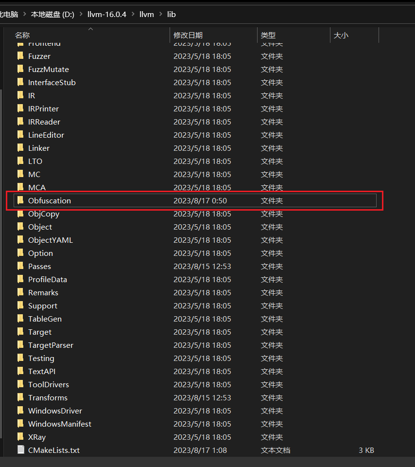
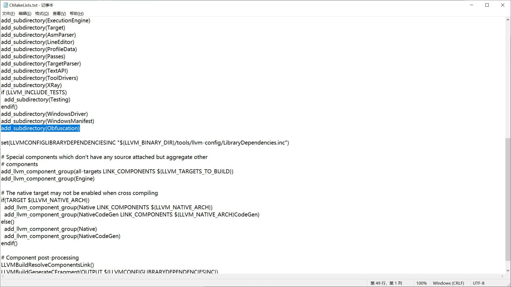
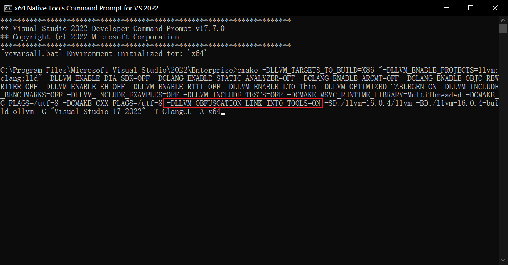

# OLLVM-16

Obfuscator-LLVM for LLVM 16.x branch

Porting tutorial: [将OLLVM从LLVM4移植到LLVM16](https://wwh1004.com/porting-ollvm-from-llvm-4-to-llvm-16/)

## Features

1. Original obfuscation passes including bogus control flow (-bcf), split basic block (-split), control flow flattening (-fla) and substitution (-sub).
1. Porting to new pass manager
1. Many bugs fixed

## Usage

``` dos
clang -mllvm -sub -mllvm -split -mllvm -fla -mllvm -bcf main.c
```

``` dos
clang -mllvm -sub -mllvm -sub_loop=3 -mllvm -split -mllvm -split_num=3 -mllvm -fla -mllvm -bcf -mllvm -bcf_loop=3 -mllvm -bcf_prob=40 main.c
```

## Building

### 1. Add Source

Move 'Obfuscation' directory to 'llvm-project/llvm/lib' directory.



### 2. Update CMakeLists.txt

Find 'llvm-project/llvm/lib/CMakeLists.txt' and append 'add_subdirectory(Obfuscation)'



### 3. Configure CMake

Pass '-DLLVM_OBFUSCATION_LINK_INTO_TOOLS=ON' to CMake (If you use Windows)



## Downloads

I've built llvm-16.x with this repo for Windows X86 user. You can download binaries in GitHub Releases page.
